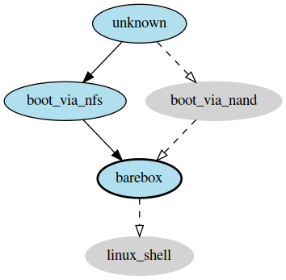
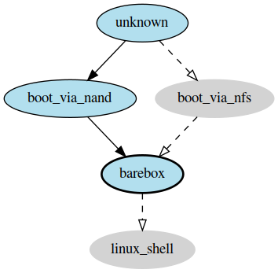

Development
============
The first step is to install labgrid into a local virtualenv.

Installation
------------

Clone the git repository:

.. code-block:: bash

   git clone https://github.com/labgrid-project/labgrid && cd labgrid

Create and activate a virtualenv for labgrid:

.. code-block:: bash

   virtualenv -p python3 venv
   source venv/bin/activate
   pip install --upgrade pip

Install required dependencies:

.. code-block:: bash

   sudo apt install python3-dev libow-dev

Install labgrid with development dependencies into the virtualenv in editable
mode:

.. code-block:: bash

   pip install -e ".[dev]"

Tests can now be run via:

.. code-block:: bash

   python -m pytest --lg-env <config>

Writing a Driver
----------------

To develop a new driver for labgrid, you need to decide which protocol to
implement, or implement your own protocol.
If you are unsure about a new protocol's API, just use the driver directly from
the client code, as deciding on a good API will be much easier when another
similar driver is added.

labgrid uses the `attrs library <https://attrs.readthedocs.io>`_ for internal
classes.
First of all import attr, the protocol and the common driver class
into your new driver file.

.. testcode::

    import attr

    from labgrid.driver import Driver
    from labgrid.protocol import ConsoleProtocol

Next, define your new class and list the protocols as subclasses of the new
driver class.
Try to avoid subclassing existing other drivers, as this limits the flexibility
provided by connecting drivers and resources on a given target at runtime.

.. testcode::

    import attr

    from labgrid.driver import Driver
    from labgrid.protocol import ConsoleProtocol

    @attr.s(eq=False)
    class ExampleDriver(Driver, ConsoleProtocol):
        pass

The ConsoleExpectMixin is a mixin class to add expect functionality to any
class supporting the :any:`ConsoleProtocol` and has to be the first item in the
subclass list.
Using the mixin class allows sharing common code, which would otherwise need to
be added into multiple drivers.

.. testcode::

    import attr

    from labgrid.driver import Driver
    from labgrid.driver.consoleexpectmixin import ConsoleExpectMixin
    from labgrid.protocol import ConsoleProtocol

    @attr.s(eq=False)
    class ExampleDriver(ConsoleExpectMixin, Driver, ConsoleProtocol):
        pass

Additionally the driver needs to be registered with the :any:`target_factory`
and provide a bindings dictionary, so that the :any:`Target` can resolve
dependencies on other drivers or resources.

.. testsetup:: example-driver1

    from labgrid.factory import target_factory
    target_factory.all_classes.pop('ExampleDriver', None)

.. testcode:: example-driver1

    import attr

    from labgrid.factory import target_factory
    from labgrid.driver import Driver
    from labgrid.driver.consoleexpectmixin import ConsoleExpectMixin
    from labgrid.protocol import ConsoleProtocol

    @target_factory.reg_driver
    @attr.s(eq=False)
    class ExampleDriver(ConsoleExpectMixin, Driver, ConsoleProtocol):
        bindings = { "port": "SerialPort" }

The listed resource :code:`SerialPort` will be bound to :code:`self.port`,
making it usable in the class.
Checks are performed that the target which the driver binds to has a SerialPort,
otherwise an error will be raised.

If your driver can support alternative resources, you can use a set of classes
instead of a single class::

    bindings = { "port": {"SerialPort", "NetworkSerialPort"} }

Optional bindings can be declared by including ``None`` in the set::

    bindings = { "port": {"SerialPort", "NetworkSerialPort", None} }

If you need to do something during instantiation, you need to add a
:code:`__attrs_post_init__` method (instead of the usual :code:`__init__` used
for non-attr-classes).
The minimum requirement is a call to :code:`super().__attrs_post_init__()`.

.. testsetup:: example-driver2

    from labgrid.factory import target_factory
    target_factory.all_classes.pop('ExampleDriver', None)

.. testcode:: example-driver2

    import attr

    from labgrid.factory import target_factory
    from labgrid.driver import Driver
    from labgrid.driver.consoleexpectmixin import ConsoleExpectMixin
    from labgrid.protocol import ConsoleProtocol

    @target_factory.reg_driver
    @attr.s(eq=False)
    class ExampleDriver(ConsoleExpectMixin, Driver, ConsoleProtocol):
        bindings = { "port": "SerialPort" }

        def __attrs_post_init__(self):
            super().__attrs_post_init__()

All that's left now is to implement the functionality described by the used
protocol, by using the API of the bound drivers and resources.

Writing a Resource
-------------------

To add a new resource to labgrid, we import attr into our new resource file.
Additionally we need the :any:`target_factory` and the common ``Resource`` class.

.. testcode::

    import attr

    from labgrid.factory import target_factory
    from labgrid.resource import Resource

Next we add our own resource with the :code:`Resource` parent class and
register it with the :any:`target_factory`.

.. testcode::

    import attr

    from labgrid.factory import target_factory
    from labgrid.resource import Resource

    @target_factory.reg_resource
    @attr.s(eq=False)
    class ExampleResource(Resource):
        pass

All that is left now is to add attributes via :code:`attr.ib()` member
variables.

.. testsetup:: example-resource

    from labgrid.factory import target_factory
    target_factory.all_classes.pop('ExampleResource', None)

.. testcode:: example-resource

    import attr

    from labgrid.factory import target_factory
    from labgrid.resource import Resource

    @target_factory.reg_resource
    @attr.s(eq=False)
    class ExampleResource(Resource):
        examplevar1 = attr.ib()
        examplevar2 = attr.ib()

The :code:`attr.ib()` style of member definition also supports defaults and
validators, see the `attrs documentation <https://attrs.readthedocs.io/en/stable/>`_.

Writing a Strategy
------------------

labgrid offers only basic strategies, for complex use cases a customized
strategy is required.
Start by creating a strategy skeleton:

.. testcode::

    import enum

    import attr

    from labgrid.step import step
    from labgrid.strategy import Strategy, StrategyError
    from labgrid.factory import target_factory

    class Status(enum.Enum):
        unknown = 0

    @target_factory.reg_driver
    class MyStrategy(Strategy):
        bindings = {
        }

        status = attr.ib(default=Status.unknown)

        @step()
        def transition(self, status, *, step):
            if not isinstance(status, Status):
                status = Status[status]
            if status == Status.unknown:
                raise StrategyError(f"can not transition to {status}")
            elif status == self.status:
                step.skip("nothing to do")
                return  # nothing to do
            else:
                raise StrategyError(
                    f"no transition found from {self.status} to {status}"
                )
            self.status = status

The ``bindings`` variable needs to declare the drivers necessary for the
strategy, usually one for power, bootloader and shell.
It is possible to reference drivers via their protocol, e.g.
``ConsoleProtocol``.
Note that drivers which implement multiple protocols must not be referenced
multiple times via different protocols.
The ``Status`` class needs to be extended to cover the states of your strategy,
then for each state an ``elif`` entry in the transition function needs to be
added.

Lets take a look at the builtin `BareboxStrategy`.
The Status enum for the BareboxStrategy:

::

   class Status(enum.Enum):
       unknown = 0
       off = 1
       barebox = 2
       shell = 3

defines three custom states and the `unknown` state as the start point.
These three states are handled in the transition function:

::

    elif status == Status.off:
        self.target.deactivate(self.barebox)
        self.target.deactivate(self.shell)
        self.target.activate(self.power)
        self.power.off()
    elif status == Status.barebox:
        self.transition(Status.off)
        # cycle power
        self.power.cycle()
        # interrupt barebox
        self.target.activate(self.barebox)
    elif status == Status.shell:
        # transition to barebox
        self.transition(Status.barebox)
        self.barebox.boot("")
        self.barebox.await_boot()
        self.target.activate(self.shell)

Here, the `barebox` state simply cycles the board and activates the driver,
while the `shell` state uses the barebox state to cycle the board and then boot
the linux kernel.
The `off` state switches the power off.

Oftentimes it is also necessary to wait for specific resources to appear before
a transition can be continued. The `await_resources` function of the target
implements this functionality, it expects a list of resources to wait for and
optionally takes a timeout and whether the resource should be available or
unavailable.

Tips for Writing and Debugging Tests
------------------------------------

Live-Reading Console Output
~~~~~~~~~~~~~~~~~~~~~~~~~~~

When starting labgrid with ``--lg-log`` option, it will dump the input from the
serial driver to a file in specified directory::

  $ pytest [OPTIONS] --lg-log=logdir test-dir/

This can help understanding what happened and why it happened.
However, when debugging tests, it might be more helpful to get a live
impression of what is going on.
For this, you can use ``tail -F`` to read the content written to the log file
as if you would be connected to the device's serial console (except that it is
read-only)::

  $ tail -F logdir/console_main # for the 'main' target

For getting information about timing, the ``annotate-output`` command turned
out to be quite helpful.
On Debian it comes with the ``devscripts`` package and you can install it
with::

  $ sudo apt install devscripts

To use it, run::

  $ annotate-output tail -F logdir/console_main

This will print your system time before each line, allowing you to both see
relative delays between steps in your tests as well as absolute timing of
things happening in your test environment.

Dealing With Kernel Log Verbosity
~~~~~~~~~~~~~~~~~~~~~~~~~~~~~~~~~

For testing your Linux system it can be quite annoying if the kernel outputs
verbosely to the console you use for testing.
Note that a too verbose kernel can break tests as kernel logs will pollute the
expected command outputs making it unreadable for labgrid regular expressions.

However, as the shell driver and most of the tests will depend on seeing
console output of what is going on during boot, we cannot turn off kernel
logging completely.

.. note::
  The labgrid ShellDriver itself attempts to disable console printing by
  calling ``dmesg -n 1`` as soon as having a logged-in shell.
  However, this may be too late for reliably capturing the initial login and
  shell prompt.

A proper point in time for disabling kernel output to the console is when
systemd starts.
To achieve this, make use of the ``systemd-sysctl.service`` that uses
``/etc/sysctl.d/`` to configure kernel parameters.
This way, the kernel log level can be set to 'error' by the time of service
execution with a config file like::

  $ cat /etc/sysctl.d/20-quiet-printk.conf
  kernel.printk = 3

If the *initial* kernel logging is still too high, one could also reduce this.
But note that for the standard configuration of the labgrid barebox and uboot
drivers, we need to catch the ``Linux version ...`` line to detect we
successfully left the bootloader (the ``bootstring`` attribute).
This line is only printed when having at least kernel log level 6 (notice)
enabled::

  loglevel=6

Graph Strategies
----------------

.. warning::
    This feature is experimental and brings much complexity to your project.

GraphStrategies are made for more complex strategies, with multiple, on each
other depending, states. A GraphStrategy graph has to be a directed graph with
one root state.

Using a GraphStrategy makes only sense if you have board states that are
reachable by different ways. In this case GraphStrategies reduce state
duplication.

Example
~~~~~~~

``teststrategy.py``:

.. code-block:: python
   :name: teststrategy.py

   from labgrid.strategy import GraphStrategy
   from labgrid.factory import target_factory

   @target_factory.reg_driver
   class TestStrategy(GraphStrategy):
       def state_unknown(self):
           pass

       @GraphStrategy.depends('unknown')
       def state_boot_via_nand(self):
           pass

       @GraphStrategy.depends('unknown')
       def state_boot_via_nfs(self):
           pass

       @GraphStrategy.depends('boot_via_nand', 'boot_via_nfs')
       def state_barebox(self):
           pass

       @GraphStrategy.depends('barebox')
       def state_linux_shell(self):
           pass

``test.yaml``:

.. code-block:: yaml
   :name: test.yaml

   targets:
     main:
       resources: {}
       drivers:
         TestStrategy: {}

   imports:
   - teststrategy.py

The class can also render a graph as PNG (using GraphViz):

.. doctest::
   :skipif: shutil.which('dot') is None

   >>> from labgrid.environment import Environment
   >>> env = Environment('test.yaml')
   >>> strategy = env.get_target().get_driver('Strategy')
   >>> strategy.transition('barebox', via=['boot_via_nfs'])
   ['unknown', 'boot_via_nfs', 'barebox']
   >>> strategy.graph.render("teststrategy-via-nfs")
   'teststrategy-via-nfs.png'
   >>> strategy.transition('barebox', via=['boot_via_nand'])
   ['unknown', 'boot_via_nand', 'barebox']
   >>> strategy.graph.render("teststrategy-via-nand")
   'teststrategy-via-nand.png'

   TestStrategy transitioned to 'barebox' via 'boot_via_nfs'

   TestStrategy transitioned to 'barebox' via 'boot_via_nand'

State
~~~~~

Every graph node describes a board state and how to reach it, A state
has to be a class method following this prototype:
``def state_$STATENAME(self):``. A state may not call ``transition()`` in its
state definition.

Dependency
~~~~~~~~~~

Every state, but the root state, can depend on other States, If a state has
multiple dependencies, not all of them, but one, have to be reached before
running the current state.
When no via is used during a transition the order of the given dependencies
decides which one gets called, where the first one has the highest priority
and the last one the lowest.
Dependencies are represented by graph edges.

Root State
~~~~~~~~~~

Every GraphStrategy has to has to define exactly one root state. The root state
defines the start of the graph and therefore the start of every transition.
A state becomes a root state if it has no dependencies.

Transition
~~~~~~~~~~

A transition describes a path, or a part of a path, through a GraphStrategy
graph.
Every State in the graph has a auto generated default path starting from the
root state.
So using the given example, the GraphStrategy would call the states `unknown`,
`boot_via_nand`, `barebox`, and `linux_shell` in this order if
``transition('linux_shell')`` would be called.
The GraphStrategy would prefer `boot_via_nand` over `boot_via_nfs` because
`boot_via_nand` is mentioned before `boot_via_nfs` in the dependencies of
`barebox`. If you want to reach via `boot_via_nfs` the call would look like
this: ``transition('linux_shell', via='boot_via_nfs')``.

A transition can be incremental. If we trigger a transition with
``transition('barebox')`` first, the states `unknown`, `boot_via_nand` and
`barebox` will be called in this order. If we trigger a transition
``transition('linux_shell')`` afterwards only `linux_shell` gets called. This
happens because `linux_shell` is reachable from `barebox` and the Strategy
holds state of the last walked path.
But there is a catch! The second, incremental path must be *fully* incremental
to the previous path!
For example: Lets say we reached `barebox` via `boot_via_nfs`,
(``transition('barebox', via='boot_via_nfs')``). If we trigger
``transition('linux_shell')`` afterwards the GraphStrategy would compare the last
path `'unknown', 'boot_via_nfs', 'barebox'` with the default path to
`linux_shell` which would be
`'unknown', 'boot_via_nand', 'barebox', 'linux_shell'`, and decides the path
is not fully incremental and starts over by the root state. If we had given
the second transition `boot_via_nfs` like in the first transition the paths
had been incremental.

SSHManager
----------

labgrid provides a SSHManager to allow connection reuse with control sockets.
To use the SSHManager in your code, import it from :any:`labgrid.util.ssh`:

.. doctest::

   >>> from labgrid.util import sshmanager

you can now request or remove port forwardings:

.. testsetup:: sshmanager

   from labgrid.util import sshmanager
   sshmanager.get = Mock()

.. doctest:: sshmanager

   >>> from labgrid.util import sshmanager
   >>> localport = sshmanager.request_forward('localhost', 'somehost', 3000)
   >>> sshmanager.remove_forward('localhost', 'somehost', 3000)

or get and put files:

.. doctest:: sshmanager

   >>> from labgrid.util import sshmanager
   >>> sshmanager.put_file('somehost', '/path/to/local/file', '/path/to/remote/file')

.. note::
  The SSHManager will reuse existing Control Sockets and set up a keepalive loop
  to prevent timeouts of the socket during tests.

ManagedFile
-----------
While the `SSHManager` exposes a lower level interface to use SSH Connections,
the ManagedFile provides a higher level interface for file upload to another
host. It is meant to be used in conjunction with a remote resource, and store
the file on the remote host with the following pattern:

.. code-block:: bash

   /tmp/labgrid-<username>/<sha256sum>/<filename>

Additionally it provides `get_remote_path()` to retrieve the complete file path,
to easily employ it for driver implementations.
To use it in conjunction with a `Resource` and a file:

.. testsetup:: managed-file

   import tempfile
   from labgrid.resource import Resource
   from labgrid import Target

   f = tempfile.NamedTemporaryFile()
   your_file = f.name
   your_resource = Resource(Target("main"), "example")

.. doctest:: managed-file

   >>> from labgrid.util.managedfile import ManagedFile
   >>> mf = ManagedFile(your_file, your_resource)
   >>> mf.sync_to_resource()
   >>> path = mf.get_remote_path()

Unless constructed with `ManagedFile(..., detect_nfs=False)`, ManagedFile
employs the following heuristic to check if a file is stored on a NFS share
available both locally and remotely via the same path:

  - check if GNU coreutils stat(1) with option --format exists on local and
    remote system
  - check if inode number, total size and modification timestamp match
    on local and remote system

If this is the case the actual file transfer in ``sync_to_resource`` is
skipped.

ProxyManager
------------
The proxymanager is used to open connections across proxies via an attribute in
the resource. This allows gated testing networks by always using the exporter as
an SSH gateway to proxy the connections using SSH Forwarding. Currently this is
used in the `SerialDriver` for proxy connections.

Usage:

.. testsetup:: proxy-manager

   from labgrid.resource import Resource
   from labgrid import Target

   your_resource = Resource(Target("main"), "example")
   your_resource.host = "localhost"

.. doctest:: proxy-manager

   >>> from labgrid.util.proxy import proxymanager
   >>> host, port = proxymanager.get_host_and_port(your_resource)

.. _contributing:

Contributing
------------

Thank you for thinking about contributing to labgrid!
Some different backgrounds and use-cases are essential for making labgrid work
well for all users.

The following should help you with submitting your changes, but don't let these
guidelines keep you from opening a pull request.
If in doubt, we'd prefer to see the code earlier as a work-in-progress PR and
help you with the submission process.

Workflow
~~~~~~~~

- Changes should be submitted via a `GitHub pull request
  <https://github.com/labgrid-project/labgrid/pulls>`_.
- Try to limit each commit to a single conceptual change.
- Add a signed-of-by line to your commits according to the `Developer's
  Certificate of Origin` (see below).
- Check that the tests still work before submitting the pull request. Also
  check the CI's feedback on the pull request after submission.
- When adding new drivers or resources, please also add the corresponding
  documentation and test code.
- If your change affects backward compatibility, describe the necessary changes
  in the commit message and update the examples where needed.

Code
~~~~

- Follow the :pep:`8` style.
- Use attr.ib attributes for public attributes of your drivers and resources.
- Use `isort <https://pypi.python.org/pypi/isort>`_ to sort the import
  statements.

Documentation
~~~~~~~~~~~~~

- Use `semantic linefeeds
  <http://rhodesmill.org/brandon/2012/one-sentence-per-line/>`_ in .rst files.

Building the documentation
++++++++++++++++++++++++++

When contributing to documentation it's practical to be able to build it also locally.

.. code-block:: bash

    virtualenv -p python3 labgrid-venv
    source labgrid-venv/bin/activate
    pip install --upgrade pip

    git clone https://github.com/labgrid-project/labgrid.git
    cd labgrid
    pip install -e ".[dev]"
    cd doc
    make html

Once the build is done you can see the results with ``firefox .build/html/index.html``.

If for whatever the reason you need to rebuild everything from scratch, use ``make SPHINXOPTS="-a -E" html``.

Run Tests
~~~~~~~~~

.. code-block:: bash

    $ tox -r

Developer's Certificate of Origin
~~~~~~~~~~~~~~~~~~~~~~~~~~~~~~~~~

labgrid uses the `Developer's Certificate of Origin 1.1
<https://developercertificate.org/>`_ with the same `process
<https://www.kernel.org/doc/html/latest/process/submitting-patches.html#sign-your-work-the-developer-s-certificate-of-origin>`_
as used for the Linux kernel:

  Developer's Certificate of Origin 1.1

  By making a contribution to this project, I certify that:

  (a) The contribution was created in whole or in part by me and I
      have the right to submit it under the open source license
      indicated in the file; or

  (b) The contribution is based upon previous work that, to the best
      of my knowledge, is covered under an appropriate open source
      license and I have the right under that license to submit that
      work with modifications, whether created in whole or in part
      by me, under the same open source license (unless I am
      permitted to submit under a different license), as indicated
      in the file; or

  (c) The contribution was provided directly to me by some other
      person who certified (a), (b) or (c) and I have not modified
      it.

  (d) I understand and agree that this project and the contribution
      are public and that a record of the contribution (including all
      personal information I submit with it, including my sign-off) is
      maintained indefinitely and may be redistributed consistent with
      this project or the open source license(s) involved.

Then you just add a line (using ``git commit -s``) saying:

  Signed-off-by: Random J Developer <random@developer.example.org>

using your real name (sorry, no pseudonyms or anonymous contributions).

.. _ideas:

Ideas
-----

.. please keep these sorted alphabetically

Driver Preemption
~~~~~~~~~~~~~~~~~

To allow better handling of unexpected reboots or crashes, inactive Drivers
could register callbacks on their providers (for example the BareboxDriver it's
ConsoleProtocol).
These callbacks would look for indications that the Target has changed state
unexpectedly (by looking for the bootloader startup messages, in this case).
The inactive Driver could then cause a preemption and would be activated.
The current caller of the originally active driver would be notified via an
exception.

Step Tracing
~~~~~~~~~~~~

The Step infrastructure already collects timing and nesting information on
executed commands, but is currently only used in the pytest plugin or via the
standalone StepLogger (or deprecated StepReporter).
By writing these events to a file (or sqlite database) as a trace, we can
collect data over multiple runs for later analysis.
This would become more useful by passing recognized events (stack traces,
crashes, ...) and benchmark results via the Step infrastructure.

CommandProtocol Support for Background Processes
~~~~~~~~~~~~~~~~~~~~~~~~~~~~~~~~~~~~~~~~~~~~~~~~

Currently the CommandProtocol does not support long running
processes well.
An implementation should start a new process,
return a handle and forbid running other processes in the foreground.
The handle can be used to retrieve output from a command.
